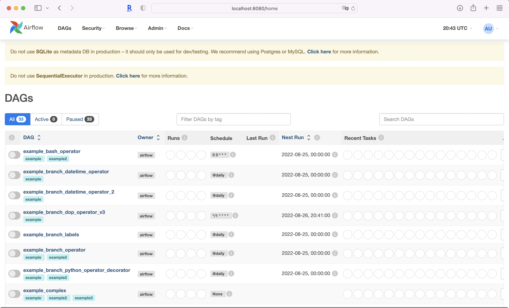
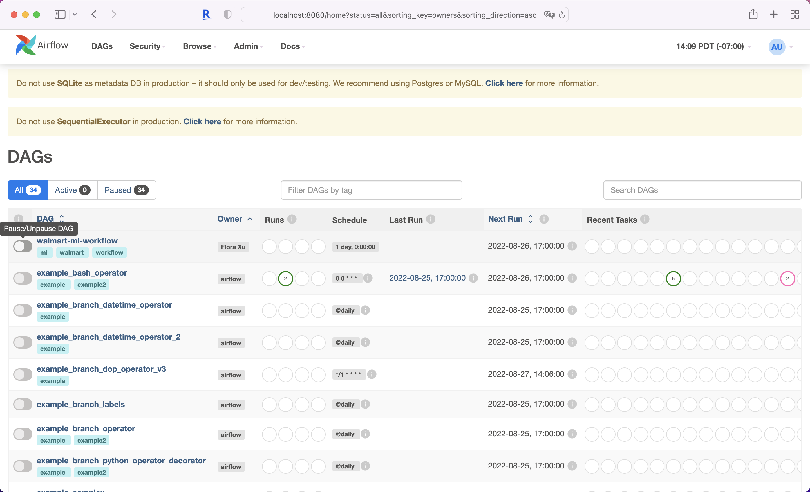
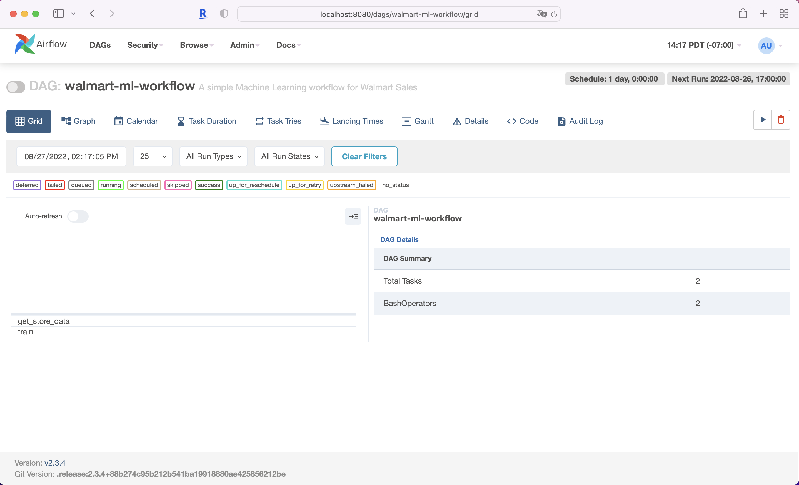
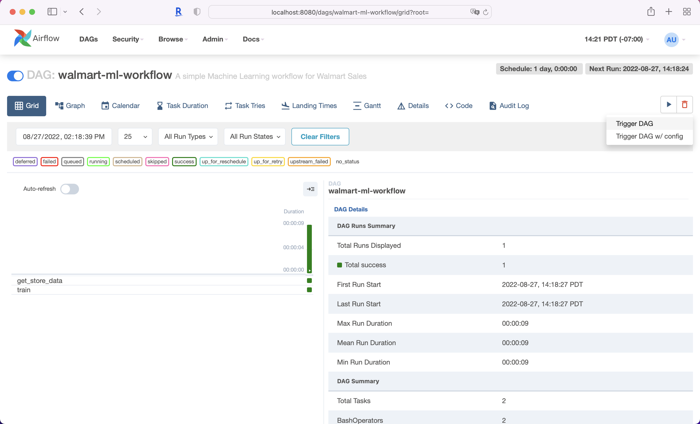
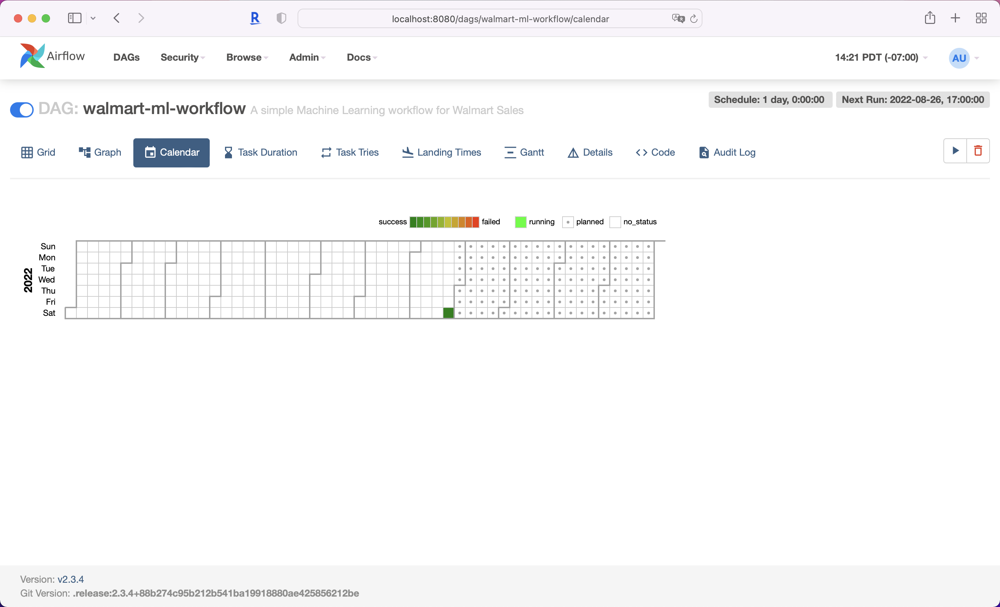

<p align = "center" draggable=”false” >
</p>

# <h1 align="center" id="heading">Workflow using Airflow</h1>
After you complete the eda-walmart-sales assignment, you now build a workflow to 
1) extract the store data 
2) train a simple model on the subset of the data
3) schedule to run the tasks every day

##  ☑️ Learning Objectives
By the end of the assignment, you will be able to: 

- understand key concepts in Airflow, such as DAGs, tasks, and operators, etc.
- build a simple workflow in Airflow
- schedule and maintain tasks in Airflow
- get oriented with Airflow's UI and API

*NOTE.* Here we skip databases and use flat files in local environment to simplify the workflow; check [here](https://airflow.apache.org/docs/apache-airflow/stable/howto/set-up-database.html) for setting up database backend. 

## Task 1. Installation 
There are two options to run Airflow [locally or in Docker](https://airflow.apache.org/docs/apache-airflow/stable/start/index.html). Instructions here are assumed to [run Airflow locally](https://airflow.apache.org/docs/apache-airflow/stable/start/local.html); yet if you are advanced in Docker, feel free to opt for Docker instead.

1. Activate your project environment if you haven't done so yet; for example,
    ```bash
    conda activate py39_12
    ```
    
    It should be OPTIONAL to install mysql `pip install mysql-connector-python`

1. Follow the instructions in [Airflow documentation](https://airflow.apache.org/docs/apache-airflow/stable/start/local.html).

    (*tested on mac os Monterey / Apple M1*)

    ```bash
    # Airflow needs a home. `~/airflow` is the default, but you can put it
    # somewhere else if you prefer (optional)
    export AIRFLOW_HOME=~/airflow

    # Install Airflow using the constraints file
    AIRFLOW_VERSION=2.3.4
    PYTHON_VERSION="$(python --version | cut -d " " -f 2 | cut -d "." -f 1-2)"
    echo $PYTHON_VERSION  # e.g.: 3.9
    CONSTRAINT_URL="https://raw.githubusercontent.com/apache/airflow/constraints-${AIRFLOW_VERSION}/constraints-${PYTHON_VERSION}.txt"
    # e.g.: https://raw.githubusercontent.com/apache/airflow/constraints-2.3.4/constraints-3.9.txt
    pip install "apache-airflow==${AIRFLOW_VERSION}" --constraint "${CONSTRAINT_URL}"
    ```

## Task 2. Launch Airflow

1. The Standalone command will initialize the database, make a user, and start all components for you.
    ```bash
    airflow standalone
    ```

    Find username `admin` and password in the terminal window, similar to the following
        
    <details>
    <summary>Show/Hide Output</summary>

    ```bash
    standalone | 
    standalone | Airflow is ready
    standalone | Login with username: admin  password: kQpVgwxyhNwq9nDE
    standalone | Airflow Standalone is for development purposes only. Do not use this in production!
    standalone | 
    ```
    </details>

    If you missed it, you shall be able to retrieve the password in file `~/airflow/standalone_admin_password.txt`.

1. Visit `localhost:8080` in the browser and log in with the admin credentials.
    <details>
    <summary>Show/Hide screenshot of the UI</summary>

    
    </details>

1. Unpause dag `tutorial` in the home page and check out each tag, e.g., Graph, Calendar, Code, etc. And get oriented in the Airflow UI. For reference, check out [tutorial](https://airflow.apache.org/docs/apache-airflow/stable/tutorial.html). 
    
## Task 3. Build and test a simple workflow

Build a workflow consisted of two tasks and run it daily.

- Extract data for Store 1 from the csv file `train_comb.csv` and save it to `train-store1.csv` to disk ( ideally use database ).
- Train a simple model on the subset of the data and [persist the model](https://scikit-learn.org/stable/model_persistence.html).

    Scripts are provided for you in the `scripts` and `dags` folders, you will need to a) put files in Airflow Home directory `~/airflow`, b) update a few spots in `dags/walmart-ml-workflow.py`, and c) test the tasks, run DAG, and check logs. 

1. Your airflow home directory shall look like this:
    ```bash
    (py39_12) flora@MacBook-Air airflow % pwd   
    /Users/flora/airflow
    (py39_12) flora@MacBook-Air airflow % tree -L 1 .
    .
    ├── airflow-webserver.pid
    ├── airflow.cfg
    ├── airflow.db
    ├── logs
    ├── standalone_admin_password.txt
    └── webserver_config.py
    ```
1. Create a new directory `dat` in your airflow home directory and add data file `train_comb.csv` in it (again, with database set up, you should not put data here).
1. Create a new directory `scripts` in your airflow home directory, and move both `get_store_data.py` and `train.py` to it. Inspect the code and understand what each script does.
1. Create a new directory `dags` in your airflow home directory, and move `walmart-ml-workflow.py` to it. 

    Inspect the structure of the workflow and update arguments `owner` (line 10) and `email` (line 12) in `default_args`.

1. Now your airflow home directory shall look similar to this:

    ```bash
    .
    ├── airflow-webserver.pid
    ├── airflow.cfg
    ├── airflow.db
    ├── dags
    │   └── walmart-ml-workflow.py
    ├── dat
    │   └── train_comb.csv
    ├── logs
    │   ├── dag_id=example_bash_operator
    │   ├── dag_id=tutorial
    │   ├── dag_processor_manager
    │   └── scheduler
    ├── scripts
    │   ├── get_store_data.py
    │   └── train.py
    ├── standalone_admin_password.txt
    └── webserver_config.py
    ```

1. And in the UI, you can find the workflow `walmart-ml-workflow` in the home page. 
    Do not unpause it until you test the tasks. 

    <details>
    <summary>Show/Hide screenshot of the UI</summary>

    
    </details>

1. Let us test each task in the workflow (feel free to replace the date in the command):

    ```
    airflow tasks test walmart-ml-workflow get_store_data 2022-08-27
    ```
    <details>
    <summary>Show/Hide last part of output</summary>

    ```bash
    --------------------------------------------------------------------------------
    [2022-08-27 14:12:42,241] {taskinstance.py:1369} INFO - Starting attempt 1 of 2
    [2022-08-27 14:12:42,241] {taskinstance.py:1370} INFO - 
    --------------------------------------------------------------------------------
    [2022-08-27 14:12:42,241] {taskinstance.py:1389} INFO - Executing <Task(BashOperator): get_store_data> on 2022-08-27T00:00:00+00:00
    [2022-08-27 14:12:42,470] {taskinstance.py:1581} INFO - Exporting the following env vars:
    AIRFLOW_CTX_DAG_EMAIL=flora@fourthbrain.ai
    AIRFLOW_CTX_DAG_OWNER=Flora Xu
    AIRFLOW_CTX_DAG_ID=walmart-ml-workflow
    AIRFLOW_CTX_TASK_ID=get_store_data
    AIRFLOW_CTX_EXECUTION_DATE=2022-08-27T00:00:00+00:00
    AIRFLOW_CTX_TRY_NUMBER=1
    AIRFLOW_CTX_DAG_RUN_ID=__airflow_temporary_run_2022-08-27T21:12:42.040824+00:00__
    [2022-08-27 14:12:42,474] {subprocess.py:62} INFO - Tmp dir root location: 
    /var/folders/dk/5zskzghd2wl17_jf1yl86hh80000gn/T
    [2022-08-27 14:12:42,474] {subprocess.py:74} INFO - Running command: ['/bin/bash', '-c', 'python3 ~/airflow/scripts/get_store_data.py']
    [2022-08-27 14:12:42,485] {subprocess.py:85} INFO - Output:
    [2022-08-27 14:12:43,255] {subprocess.py:96} INFO - Command exited with return code 0
    [2022-08-27 14:12:43,266] {taskinstance.py:1407} INFO - Marking task as SUCCESS. dag_id=walmart-ml-workflow, task_id=get_store_data, execution_date=20220827T000000, start_date=, end_date=20220827T211243
    
    ```
    </details>

    similarly, for the second task:
    ``` 
    airflow tasks test walmart-ml-workflow train 2022-08-27
    ``` 

    <details>
    <summary>Show/Hide last part of output</summary>

    ```bash
    --------------------------------------------------------------------------------
    [2022-08-27 14:14:49,528] {taskinstance.py:1369} INFO - Starting attempt 1 of 4
    [2022-08-27 14:14:49,528] {taskinstance.py:1370} INFO - 
    --------------------------------------------------------------------------------
    [2022-08-27 14:14:49,529] {taskinstance.py:1389} INFO - Executing <Task(BashOperator): train> on 2022-08-27T00:00:00+00:00
    [2022-08-27 14:14:49,705] {taskinstance.py:1581} INFO - Exporting the following env vars:
    AIRFLOW_CTX_DAG_EMAIL=flora@fourthbrain.ai
    AIRFLOW_CTX_DAG_OWNER=Flora Xu
    AIRFLOW_CTX_DAG_ID=walmart-ml-workflow
    AIRFLOW_CTX_TASK_ID=train
    AIRFLOW_CTX_EXECUTION_DATE=2022-08-27T00:00:00+00:00
    AIRFLOW_CTX_TRY_NUMBER=1
    AIRFLOW_CTX_DAG_RUN_ID=__airflow_temporary_run_2022-08-27T21:39:49.315664+00:00__
    [2022-08-27 14:14:49,705] {subprocess.py:62} INFO - Tmp dir root location: 
    /var/folders/dk/5zskzghd2wl17_jf1yl86hh80000gn/T
    [2022-08-27 14:14:49,706] {subprocess.py:74} INFO - Running command: ['/bin/bash', '-c', 'python3 ~/airflow/scripts/train.py']
    [2022-08-27 14:14:49,717] {subprocess.py:85} INFO - Output:
    [2022-08-27 14:14:51,507] {subprocess.py:92} INFO - 2022-08-27 14:39:51 INFO     X_train size (8195, 15), y_train size (8195,)
    [2022-08-27 14:14:51,508] {subprocess.py:92} INFO - 2022-08-27 14:39:51 INFO     X_test size (2049, 15), y_test size (2049,)
    [2022-08-27 14:14:51,549] {subprocess.py:92} INFO - 2022-08-27 14:39:51 INFO     model score: 0.949
    [2022-08-27 14:14:51,552] {subprocess.py:92} INFO - 2022-08-27 14:39:51 INFO     model saved to /Users/flora/airflow/models/train-store1.joblib
    [2022-08-27 14:14:51,673] {subprocess.py:96} INFO - Command exited with return code 0
    [2022-08-27 14:14:51,685] {taskinstance.py:1407} INFO - Marking task as SUCCESS. dag_id=walmart-ml-workflow, task_id=train, execution_date=20220827T000000, start_date=, end_date=20220827T213951
    ```
    </details>
    Make sure it runs successfully. If not, check the logs and make changes accordingly. There could be issues related to path or OS. 

1. Unpause the dag and run it by clicking on the play button and tapping `Trigger DAG` in the UI.

    <details>
    <summary>Show/Hide screenshot of the UI</summary>
    
    click into the dag
    

    unpause the dag and run it
    

    the calendar shows the running schedule.
    
    </details>

1. Check the home directory and you shall see new files/directories generated:
    - `dat/train-store1.csv`
    - `logs/dag_id=walmart-ml-workflow`
        ```
        .
        └── run_id=manual__2022-08-27T21:18:24.382658+00:00
            ├── task_id=get_store_data
            │   └── attempt=1.log
            └── task_id=train
                └── attempt=1.log
        ```
    - `models/train-store1.joblib`

    ```
    .
    ├── airflow-webserver.pid
    ├── airflow.cfg
    ├── airflow.db
    ├── dags
    │   ├── __pycache__
    │   └── walmart-ml-workflow.py
    ├── dat
    │   ├── train-store1.csv
    │   └── train_comb.csv
    ├── logs
    │   ├── dag_id=example_bash_operator
    │   ├── dag_id=tutorial
    │   ├── dag_id=walmart-ml-workflow
    │   ├── dag_processor_manager
    │   └── scheduler
    ├── models
    │   └── train-store1.joblib
    ├── scripts
    │   ├── get_store_data.py
    │   ├── get_store_data_wlog.py
    │   ├── train.py
    │   ├── train_wlog.py
    │   └── walmart-ml-pipeline.py
    ├── standalone_admin_password.txt
    └── webserver_config.py
    ```

    Success!

1. Modify the schedule interval to 5 minutes. You may need to pause and unpause the dag to see changes. 

1. Discuss what circumstances you would use Catchup or Backfill in Airflow (ref: [Re-run DAG](https://airflow.apache.org/docs/apache-airflow/stable/dag-run.html#re-run-dag)).

1. When you are done, pause the dag, and shutdown the webserver.

