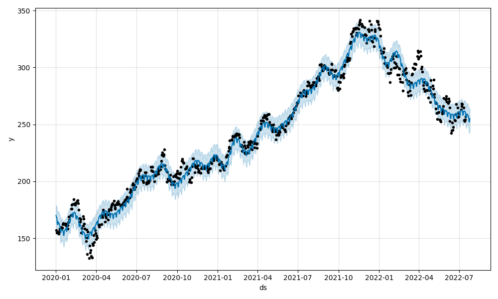
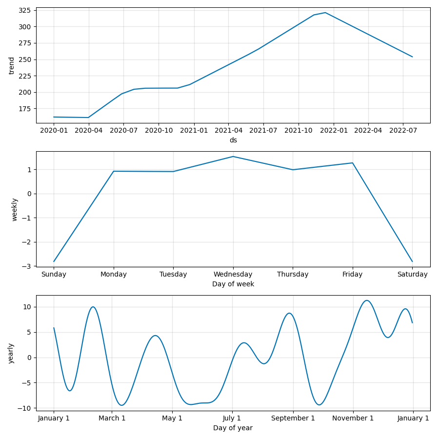
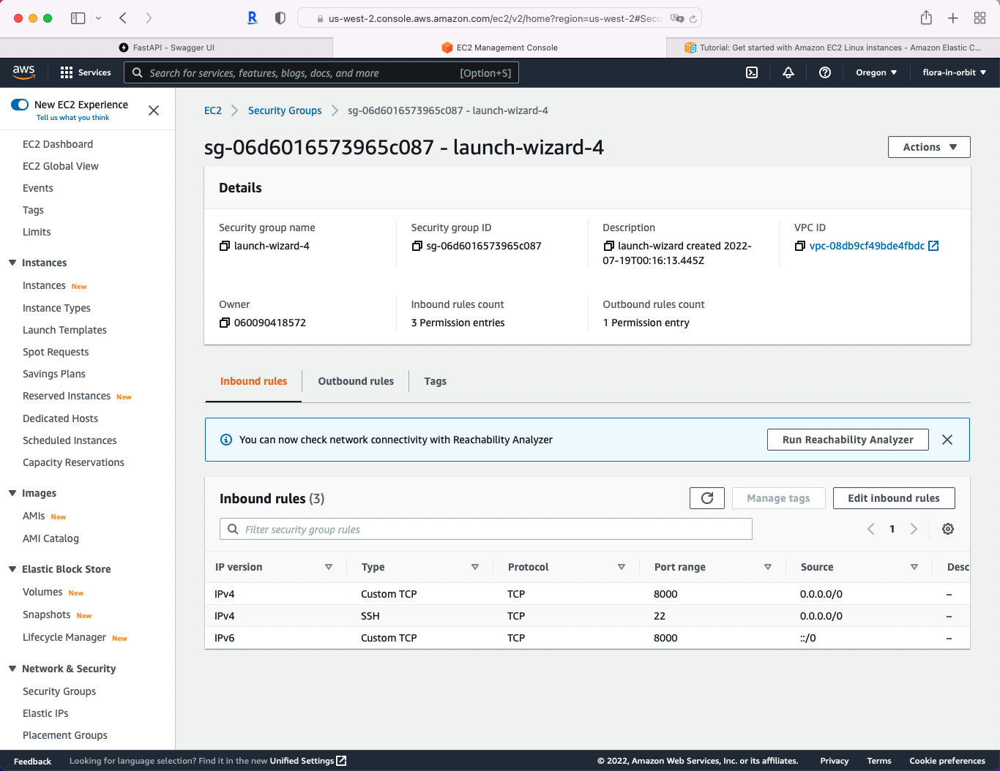
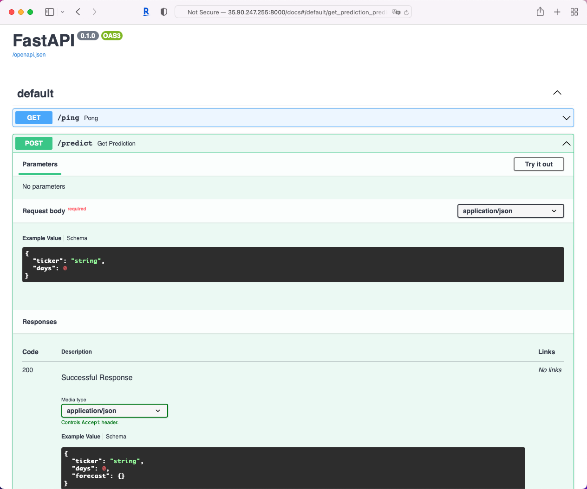
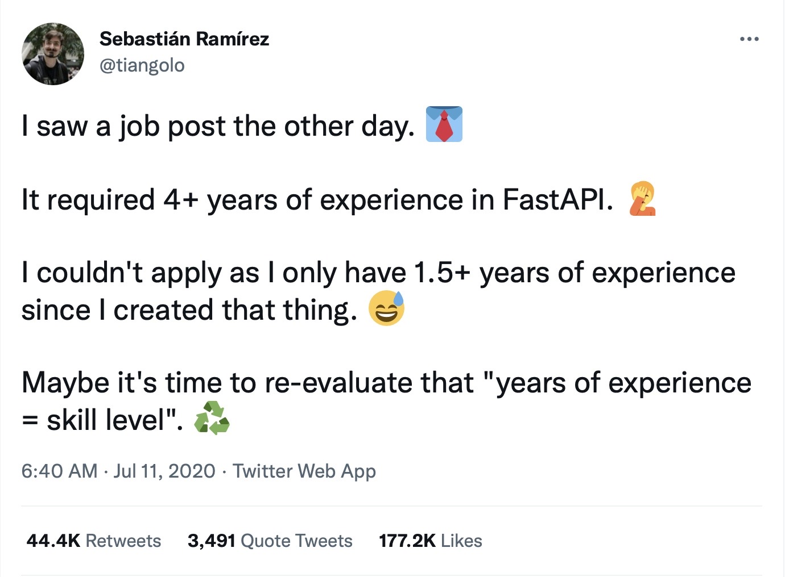

<p align = "center" draggable=â€false†>
</p>

# Stock Prophet 

Today, we will be **deploying** a stock prediction model as a RESTful API using [FastAPI](https://fastapi.tiangolo.com/) to AWS EC2, and make it available (i.e., public) to end users. Less focus is put on how well the model performs, yet the goal is to get an initial working system quickly into production:
    
    data -> model -> API -> deployment

## Deliverables 

For this assignment, you will be creating a repository on GitHub for the model and dependencies, and then deploy the model to AWS EC2. Therefore, the specific deliverables are:

- Link to your public repository on GitHub 
    - scripts `model.py` and `main.py`
    - `requirements.txt` (follow instructions for its creation)
    - `README.md` that includes how to cURL your API endpoint

## Learning Objectives

By the end of this lesson, you will be able to:
- Develop a RESTful API with FastAPI
- Build a basic time series model to predict stock prices
- Deploy a FastAPI to AWS EC2

# Task 1. Project Setup

1. Create a new repository `stock-predictor` on GitHub; make sure to include:
    - `README.md`, with a title and short description of the project
    - .gitignore using `Python` template
    - MIT license

2. Create a new virtual environment for this project:
    
    `conda create -n stock-predictor python=3.8`

3. Activate the virtual environment to start the development process
    
    `conda activate stock-predictor`

4. Install the following dependencies:

    `python -m pip install -U -q fastapi uvicorn` 

5. Clone the repo to your local machine 

6. Create a file `main.py` for our app. Inside the file, create a new instance of `FastAPI` and set up a quick test route

    ```python
    from fastapi import FastAPI
    app = FastAPI()

    @app.get("/ping")
    def pong():
        return {"ping": "pong!"}
    ```

7. Launch the app in the shell and test the route using the command:
    
    `uvicorn main:app --reload --workers 1 --host 0.0.0.0 --port 8000`

    Below is the explanation of the command:
    - `--reload` enables auto-reload so the server will restart after changes are made to the code base.
    - `--workers 1` provides a single worker process.
    - `--host 0.0.0.0` defines the address to host the server on.
    - `--port 8000` defines the port to host the server on.
    - `main:app` tells `uvicorn` where it can find the `FastAPI` ASGI application. In this case, within the `main.py` file, you will find the ASGI app `app = FastAPI()`.

8. Navigate to http://localhost:8000/ping in your browser. You should see:

    ```json
    {
        "ping": "pong!"
    }
    ```

# Task 2. Time series model

We will use [Prophet](https://facebook.github.io/prophet/) to predict stock market prices. 

1. Install the dependencies:
    - Basic data manipulation and plotting: `pandas matplotlib`
    - Data and modeling: `yfinance pystan prophet joblib`
    - Advanced visualization `plotly`

    __NOTE for Apple silicon__ in order to make this work you need to install specific versions of some packages:

    `pystan==2.19.1.1`

    `prophet==1.0`

2. Create a new file `model.py` and add the following code to train the model and generate a prediction:

    ```python
    import datetime
    from pathlib import Path

    import joblib
    import pandas as pd
    import yfinance as yf
    from prophet import Prophet

    import argparse

    BASE_DIR = Path(__file__).resolve(strict=True).parent
    TODAY = datetime.date.today()


    def train(ticker="MSFT"):
        data = yf.download(ticker, "2020-01-01", TODAY.strftime("%Y-%m-%d"))

        df_forecast = data.copy()
        df_forecast.reset_index(inplace=True)
        df_forecast["ds"] = df_forecast["Date"]
        df_forecast["y"] = df_forecast["Adj Close"]
        df_forecast = df_forecast[["ds", "y"]]
        df_forecast

        model = Prophet()
        model.fit(df_forecast)

        joblib.dump(model, Path(BASE_DIR).joinpath(f"{ticker}.joblib"))


    def predict(ticker="MSFT", days=7):
        model_file = Path(BASE_DIR).joinpath(f"{ticker}.joblib")
        if not model_file.exists():
            return False

        model = joblib.load(model_file)

        future = TODAY + datetime.timedelta(days=days)

        dates = pd.date_range(start="2020-01-01", end=future.strftime("%m/%d/%Y"),)
        df = pd.DataFrame({"ds": dates})

        forecast = model.predict(df)

        model.plot(forecast).savefig(f"{ticker}_plot.png")
        model.plot_components(forecast).savefig(f"{ticker}_plot_components.png")

        return forecast.tail(days).to_dict("records")

    def convert(prediction_list):
        output = {}
        for data in prediction_list:
            date = data["ds"].strftime("%m/%d/%Y")
            output[date] = data["trend"]
        return output


    if __name__ == "__main__":
        parser = argparse.ArgumentParser(description='Predict')
        parser.add_argument('--ticker', type=str, default='MSFT', help='Stock Ticker')
        parser.add_argument('--days', type=int, default=7, help='Number of days to predict')
        args = parser.parse_args()
        
        train(args.ticker)
        prediction_list = predict(ticker=args.ticker, days=args.days)
        output = convert(prediction_list)
        print(output)
    ```

    Here we defined three functions (this model was developed by [Andrew Clark](https://twitter.com/aclarkdata1)):

    1. `train` downloads historical stock data with [`yfinance`](https://github.com/ranaroussi/yfinance), creates a new Prophet model, fits the model to the stock data, and then serializes and saves the model as a [`Joblib file`](https://joblib.readthedocs.io/en/latest/generated/joblib.dump.html).

    2. `predict` loads and deserializes the saved model, generates a new forecast, creates images of the forecast plot and forecast components, and returns the days included in the forecast as a list of dicts.

    3. `convert` takes the list of dicts from `predict` and outputs a dict of dates and forecasted values; e.g., `{"07/02/2020": 200}`).

    4. The last block of code allows you to execute the model from the command line, with two arguments, a valid stock ticker and the number of days to predict. 

3. Let's run it and see the results. In a shell, run:
    
    `python model.py`

    Output shall looks similar to the following (the output was generated in the late afternoon on July 19, 2022)

    ```
    [*********************100%***********************]  1 of 1 completed
    15:30:36 - cmdstanpy - INFO - Chain [1] start processing
    15:30:36 - cmdstanpy - INFO - Chain [1] done processing
    {'07/20/2022': 254.67755986604763, '07/21/2022': 254.3739109884936, '07/22/2022': 254.0702621109396, '07/23/2022': 253.7666132333857, '07/24/2022': 253.46296435583167, '07/25/2022': 253.15931547827768, '07/26/2022': 252.8556666007237}
    15:30:38 - cmdstanpy - INFO - deleting tmpfiles dir: /var/folders/dk/5zskzghd2wl17_jf1yl86hh80000gn/T/tmpzwrmagib
    15:30:38 - cmdstanpy - INFO - done
    ```

    ```
    {
        '07/20/2022': 254.67755986604763, 
        '07/21/2022': 254.3739109884936, 
        '07/22/2022': 254.0702621109396, 
        '07/23/2022': 253.7666132333857, 
        '07/24/2022': 253.46296435583167, 
        '07/25/2022': 253.15931547827768, 
        '07/26/2022': 252.8556666007237
    }
    ```
    are the predicted prices for the next 7 days for the Microsoft stock (ticker: MSFT).

    Take note that the saved `MSFT.joblib` model along with two images

    <p align="center">
    
    
    </p>

14. Feel free to make more models, e.g.,
    ```
    python model.py --ticker AAPL --days 7
    python model.py --ticker GOOG --days 7
    ```

5. Push your changes as you go, as long as there are no errors.

## Task 3. Routes

In this task, we will wire up our API. 

1. Add a `/predict` endpoint by updating `main.py`:
    ```python
    from fastapi import FastAPI, Query, HTTPException
    from pydantic import BaseModel
    from model import predict, convert

    app = FastAPI()

    # pydantic models
    class StockIn(BaseModel):
        ticker: str
        days: int

    class StockOut(StockIn):
        forecast: dict

    @app.post("/predict", response_model=StockOut, status_code=200)
    def get_prediction(payload: StockIn):
        ticker = payload.ticker
        days = payload.days

        prediction_list = predict(ticker, days)

        if not prediction_list:
            raise HTTPException(status_code=400, detail="Model not found.")

        response_object = {
            "ticker": ticker, 
            "days": days,
            "forecast": convert(prediction_list)}
        return response_object
    ```

    So, in the new function `get_prediction`, we passed in a ticker to our model's `predict` and then used `convert` to create the output for the response object. We also took advantage of a `pydantic` [schema](https://pydantic-docs.helpmanual.io/usage/schema/) to covert the JSON payload to a `StockIn` object schema. This provides automatic type validation. The response object uses the `StockOut` schema object to convert the Python `dict` - `{"ticker": ticker, "days": days, "forecast": convert(prediction_list)}` - to JSON, which, again, is validated.

2. Disable plotting for the web app.
Let's just output the forecast in JSON. Comment out the following lines in `predict` in `model.py`:

    ```python
    # model.plot(forecast).savefig(f"{ticker}_plot.png")
    # model.plot_components(forecast).savefig(f"{ticker}_plot_components.png")
    ```

    Optional: Comment out or remove the `if name == __main__` block in `model.py`.

3. Run the app locally.

    ```uvicorn main:app --reload --workers 1 --host 0.0.0.0 --port 8000```

4. Test the endpoint. Open a new shell, use `curl` to test the endpoint:

    ```
    curl \
    --header "Content-Type: application/json" \
    --request POST \
    --data '{"ticker":"MSFT", "days":7}' \
    http://0.0.0.0:8000/predict
    ```

    You shall see something like:

    ```python
    {
        "ticker":"MSFT",
        "days":7,
        "forecast":{
            "07/20/2022":254.67755986604763,
            "07/21/2022":254.3739109884936,
            "07/22/2022":254.0702621109396,
            "07/23/2022":253.7666132333857,
            "07/24/2022":253.46296435583167,
            "07/25/2022":253.15931547827768,
            "07/26/2022":252.8556666007237
        }
    }
    ```

5. Try it with a different ticker. What happens if the input ticker doesn't have a trained model or the ticker is not valid?

6. Navigate to `http://127.0.0.1:8000/docs` (or `http://localhost:8000/docs`) and see the interactive API documentation (you can take a sneak peek [here](http://35.90.247.255:8000/docs)).

7. Generate requirements file for your working app in a shell:

    ```
    pip list --format=freeze > requirements.txt
    ```

8. If you have not been "ABC: always be committing", make sure that all components are working with no errors, then push your changes. 

    ```
    git add .
    git commit -m "create a model and its endpoint"
    git push
    ```

    <details> 
    <summary> Click here to see a sample structure of the repository </summary>

    Don't worry if your scripts are not wrapped under `src` folder.

    ```
    .
    ├── LICENSE
    ├── README.md
    ├── requirements.txt
    ├── src
    │   ├── AAPL.joblib
    │   ├── AAPL_plot.png
    │   ├── AAPL_plot_components.png
    │   ├── CVX.joblib
    │   ├── CVX_plot.png
    │   ├── CVX_plot_components.png
    │   ├── INTC.joblib
    │   ├── INTC_plot.png
    │   ├── INTC_plot_components.png
    │   ├── MRK.joblib
    │   ├── MRK_plot.png
    │   ├── MRK_plot_components.png
    │   ├── MSFT.joblib
    │   ├── MSFT_plot.png
    │   ├── MSFT_plot_components.png
    │   ├── __pycache__
    │   │   ├── main.cpython-38.pyc
    │   │   └── model.cpython-38.pyc
    │   ├── main.py
    └── └── model.py
    ```
    </details>


## Task 4. AWS Deployment

1. Create your EC2 instance in the AWS management tool. The UI is straightforward and for most settings, use the default. Refer to the [tutorial](https://docs.aws.amazon.com/AWSEC2/latest/UserGuide/EC2_GetStarted.html#ec2-launch-instance) for more information. Note:

    - Use `stock-predictor-fastapi` for the **Key pair name** when generating the `pem` file.

    - In Step 1-7 **Network Setting**: click `Edit` and make sure you have two (or three) security group rules. One has the type SSH with port 22, and another TCP port for the API, e.g., `8000`, edit the source. See the bottom of the screenshot below for reference. 

        <p align="center">
        
        </p>

2. Once you launch the instance, it should take ~30 seconds to start. Click into your instance. Refresh to see the `Connect` button is no longer grayed out, and click `Connect`. 

3. In the `Connect to instance` tab, find `SSH client`. Move the `stock-predicr-fastapi.pem` file you downloaded earlier to your local repo. Follow the instruction, change the permissions:

    ```
    chmod 400 stock-predictor-fastapi.pem
    ```

4. Update file `.gitignore` to include the `pem` file, and push all your working code to the repository. **NEVER** push your secret keys to the repository.

5. Access the EC2 Instance using ssh. In the same `Connect to instance` tab, you can find the command to access the instance via ssh, something like:

    `ssh -i "stock-predictor-fastapi.pem" ec2-user@ec2-35-90-247-255.us-west-2.compute.amazonaws.com`

    Run the command where `stock-predictor-fastapi.pem` is located.  

6. If you see something similar to the following, then congratulations! you are in the right place:
    ```
    flora@MacBook-Air stock-predictor % ssh -i "stock-predictor-fastapi.pem" ec2-user@ec2-35-90-247-255.us-west-2.compute.amazonaws.com
    Last login: Tue Jul 19 21:58:43 2022 from 47.157.165.203

        __|  __|_  )
        _|  (     /   Amazon Linux 2 AMI
        ___|\___|___|

    https://aws.amazon.com/amazon-linux-2/
    [ec2-user@ip-172-31-24-66 ~]$ 
    ```

7. Set up environment
    ```
    sudo yum update -y 
    sudo yum install git -y  # install git

    # install tmux to switch easily between programs in one terminal
    sudo yum install tmux

    # install miniconda and add its path to env
    wget https://repo.continuum.io/miniconda/Miniconda3-latest-Linux-x86_64.sh -O ~/miniconda.sh
    bash ~/miniconda.sh -b -p ~/miniconda
    echo "PATH=$PATH:$HOME/miniconda/bin" >> ~/.bashrc
    source ~/.bashrc
    ```
8. Clone the repository (use https for convenience) and install all dependencies
    ```
    git clone https://github.com/[YOUR HANDLER]/stock-predictor.git
    cd stock-predictor
    pip install -U pip
    pip install -r requirements.txt
    ```
9. Before launching the app, we can avoid ssh time out using `tmux` to create a new session. 
    ```
    tmux new -s stock_session
    ```
    If you skip this step, the app will be closed after you exit the ssh session.
10. Navigate to the same directory where `main.py` is (e.g., repo root directory or `src`) and run the app

    ```
    uvicorn main:app --reload --workers 1 --host 0.0.0.0 --port 8000
    ```

    The shell looks like this:
    ```
    [ec2-user@ip-172-31-24-66 src]$ uvicorn main:app --reload --workers 1 --host 0.0.0.0 --port 8000                                                  
    INFO:     Will watch for changes in these directories: ['/home/ec2-user/stock-predictor/src']
    INFO:     Uvicorn running on http://0.0.0.0:8000 (Press CTRL+C to quit)
    INFO:     Started reloader process [9693] using StatReload
    INFO:     Started server process [9695]
    INFO:     Waiting for application startup.
    INFO:     Application startup complete.
    ```
    
11. Now find the Public IPv4 address for your instance, e.g., 35.90.247.255, and run the following in another shell on your local machine:

    ```
    curl \
    --header "Content-Type: application/json" \
    --request POST \
    --data '{"ticker":"MSFT", "days":7}' \
    http://35.90.247.255:8000/predict
    ```

    You shall see the predictions 🎉🎉🎉

    Don't forget to include this command to the README.md file.

12. Final step: detach `tmux` session so that it continues running in the background when you leave ssh shell. Press `Ctrl`+`b`, release, then press `d` (NOT `Ctrl`, `b`, and `d` together). Then you can leave the ssh shell and the app will continue running.

    You can attach the session by running `tmux attach -t stock_session`.

13. You shall be able to access the API documentation and share it with others. Use the Public IP address for your EC2 instance, e.g., `http://35.90.247.255:8000/docs`. 

    <details>
    <summary> Screenshots of the docs.
    </summary>

    Click `Try it out` to make predictions interactively.

    <p align="center">
    
    
    </p>
    </details>

## Task 5. Next Steps
Now that a working system is up and running, discuss what next steps are for the project.

<details>
Could be any of the following, and not limited to:

- CI / CD
- save models into s3 bucket(s)
- testing
- containerization (next week!)
- documentation
- elastic address 
</details>


Note. As a machine learning engineering, consider to follow a 20/80 rule when it comes to time budget: spend 20% time to get initial working system, 80% on iterative development. When building an end-to-end machine learning pipeline, you will discover hidden bugs or issues that are not obvious when you focus on modeling. 

    "The final goal of all industrial machine learning (ML) projects is to develop ML products and rapidly bring them into production."


# Fun fact
<p align="center">

</p>

# Acknowledgement & Reference

- This assignment is adapted from [Deploying and Hosting a Machine Learning Model with FastAPI and Heroku](https://testdriven.io/blog/fastapi-machine-learning/)
- To learn about API in general, [Postman Learning Center](https://learning.postman.com/docs/getting-started/introduction/) is a good starting point.
- [Machine Learning Operations (MLOps): Overview, Definition, and Architecture (July 2022)](https://arxiv.org/ftp/arxiv/papers/2205/2205.02302.pdf)