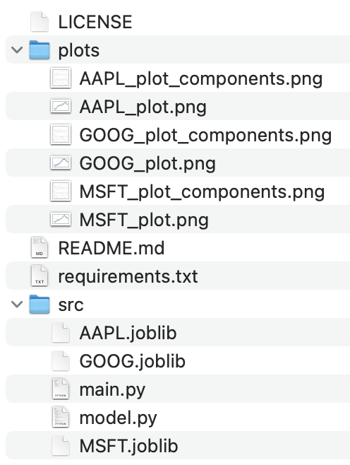

<p align = "center" draggable=”false” >
</p>

# Build Container Image for FastAPI Applications

Building upon the stock prediction app from last week, you now build a container image for your FastAPI application. 

## Deliverables

- Link to the feature branch of your project repository
    - `Dockerfile`

## Learning Objectives

By the end of this session, you should be able to:

- Understand basic operations of Docker
- Write a Dockerfile to build a container image
- Build a container image for a FastAPI application

You can refer to [FastAPI in Containers - Docker](https://fastapi.tiangolo.com/deployment/docker/#dockerfile) for more explanations.


## Task 1. Prep

1. Start a new feature branch for your project, name it `container`.

NOTE You should be in `stock_predictor` conda environment. 

    ``` git checkout -b container ```

2. Install Docker if you have not done so yet and launch Docker. 

    You can verify the installation by running the following command:

    ``` docker --version ```

    If you see something like `Docker version 20.10.13, build a224086`, you have successfully installed Docker.
    
    If you see an error relating to permissions - please follow [these steps](https://docs.docker.com/engine/install/linux-postinstall/)!

3. Create a `.dockerignore` file in your project directory. 
Make sure that the `.dockerignore` file is in the root directory. 

    ``` echo "__pycache__\nenv\n.pem" > .dockerignore ```

4. If your project did not contain `src/` directory, create one and move all the `.joblib` files and `.py` filed to the `src/` directory.

HINT: use `mkdir` and `mv`.

Here is a sample directory structure:

<p align = "center" draggable=”false” >
</p>

5. Make sure you uncomment the `ping` end-point in your `main.py`!

## Task 2: Dockerfile

1. Create a new file `Dockerfile` in the repo and follow steps 2-8 to complete `Dockerfile`.

Note that the second command requires `vim`.

    ``` touch Dockerfile # or vi Dockerfile ```
    
2. Start from the official Python base image in your `Dockerfile`.

    ```
    FROM python:3.8
    ```

3. Set the working directory to the root of your project inside the container.

    ```
    WORKDIR .
    ```

4. Install appropriate dependencies.

    ```
    RUN apt-get -y update  && apt-get install -y \
        python3-dev \
        apt-utils \
        python-dev \
        build-essential \   
    && rm -rf /var/lib/apt/lists/* 
    ```

5. Install `pystan` (later when building the image, you will see this step takes a long time). 

    `prophet` requires that `pystan` be installed. And `pystan` is bit tricky to install; we need to install `cython` and `numpy` first.

    ```
    RUN pip install --no-cache-dir -U pip
    RUN pip install --no-cache-dir -U cython
    RUN pip install --no-cache-dir -U numpy
    RUN pip install --no-cache-dir -U pystan
    ```

6. Copy the file with the requirements to the `.` (current/root) directory.

    ```
    COPY requirements.txt .
    RUN pip install --no-cache-dir -U -r  requirements.txt
    ```

    NOTE To avoid errors related to different OS environments during installation, you can edit the requirements file to the following:

    ```
    fastapi 
	uvicorn
	pandas
	yfinance
	prophet
	joblib
	argparse
    ```

	If you commented out the code snippet that starts with `if __name__ == "__main__":` in your `main.py`, you can remove argparse from your requirements file. 

7. Copy everything under `src/` directory inside `.` directory.

    As this has all the code which is what changes most frequently the Docker cache won't be used for this or any following steps easily.

    So, it's important to put this near the end of the Dockerfile, to optimize the container image build times. 

    Make sure you have `main.py`, `model.py` and the model files `.joblib` in `src/` directory. 

    Read [Docker Cache](https://fastapi.tiangolo.com/deployment/docker/#docker-cache) for more information.
    
    ```
    COPY src/ .
    ```
    
8. We'll expose port 8000 with the following text:

	```docker
	EXPOSE 8000
	```

9. Lastly, set the command to run the `uvicorn` server.

    `CMD` takes a list of strings, each of these strings is what you would type in the command line separated by spaces.

    This command will be run from the **current working directory**, the same `.` directory you set above with `WORKDIR .`.

    Because the program will be started at `.` and inside of it are your scripts and models, `uvicorn` will be able to see and import `app` from `main`.

## Task 3. Build the Docker Image

1. Build the container image: 
    
    `docker build -t stock-prophet .`

    <details>
    <summary> Click here to see sample output </summary>
    
    Notice that step 6/10 took the longest to build.

    ```
    [+] Building 669.2s (14/14) FINISHED                                                                
    => [internal] load build definition from Dockerfile                                           0.0s
    => => transferring dockerfile: 519B                                                           0.0s
    => [internal] load .dockerignore                                                              0.0s
    => => transferring context: 34B                                                               0.0s
    => [internal] load metadata for docker.io/library/python:3.8                                  0.5s
    => [ 1/10] FROM docker.io/library/python:3.8@sha256:7d870123fe736cc912528a4f29c380d19f5efa29  0.0s
    => [internal] load build context                                                              0.0s
    => => transferring context: 1.22kB                                                            0.0s
    => CACHED [ 2/10] RUN apt-get -y update && apt-get install -y   python3-dev   apt-utils   py  0.0s
    => CACHED [ 3/10] RUN pip install --no-cache-dir -U pip                                       0.0s
    => [ 4/10] RUN pip install --no-cache-dir -U cython                                           1.5s
    => [ 5/10] RUN pip install --no-cache-dir -U numpy                                            3.7s
    => [ 6/10] RUN pip install --no-cache-dir -U pystan                                         529.6s 
    => [ 7/10] COPY requirements.txt .                                                            0.0s 
    => [ 8/10] RUN pip install --no-cache-dir -U -r requirements.txt                            129.4s 
    => [ 9/10] COPY src/ .                                                                        0.1s 
    => exporting to image                                                                         4.3s 
    => => exporting layers                                                                        4.3s 
    => => writing image sha256:44e99ee39267bc9c9b65e44a67e1cd534bf98f8e0f4c469c9a617e4be8636640   0.0s 
    => => naming to docker.io/library/stock-prophet                                               0.0s 
    ```
    </details>


2. Verify that the image has been built.

    ```docker image -ls # docker images```    

    You shall see something similar to this:
    
    ```
    REPOSITORY        TAG       IMAGE ID       CREATED        SIZE
    stock-prophet     latest    44e99ee39267   25 hours ago   1.78GB
    hello-world       latest    46331d942d63   4 months ago   9.14kB
    ```

    See more images management commands [here](https://docs.docker.com/engine/reference/commandline/image/).
`docker history --no-trunc IMAGE_ID`

## Task 4: Start Docker Container

1. Before we start the container, verify that nothing is running on your localhost.

    ```curl localhost:8000```

    You shall see the following response:
    
    ```
    curl: (7) Failed to connect to localhost port 8000: Connection refused
    ```
2. Alternatively, list all the running containers:
    
    ```docker ps -a # or simply "docker ps"```
    
    You shall see something similar to this:
    
    ```
    CONTAINER ID        IMAGE               COMMAND                  CREATED             STATUS              PORTS               NAMES
    ```

3. Start the container

    ```
    docker run -d --rm --name mycontainer -p 8000:8000 stock-prophet
    ```

4. Verify that the container is running:
    
    ```docker ps -a```

    <details><summary> Expected output </summary>
    
    ```
    CONTAINER ID   IMAGE           COMMAND                  CREATED          STATUS          PORTS                    NAMES
    725a7ee73273   stock-prophet   "uvicorn main:app --…"   30 seconds ago   Up 29 seconds   0.0.0.0:8000->8000/tcp   mycontainer
    ```
    </details>

5. Now the app should be running on port 8000.
    
    ```curl localhost:8000/ping```
    
    You shall see the following response:
    
    ```
    {"ping":"pong!"}
    ```

    or getting predictions:
    ```
    curl \
    --header "Content-Type: application/json" \
    --request POST \
    --data '{"ticker":"MSFT", "days":7}' \
    http://localhost:8000/predict
    ```

    That's it, you just successfully built a Docker container for your FastAPI app! 

6. Stop the container:
    
    ```docker stop mycontainer```
    
    You shall see the following response:
    
    ```
    Stopped container mycontainer
    ```

