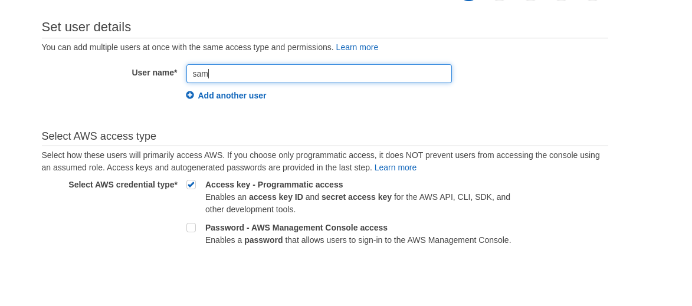
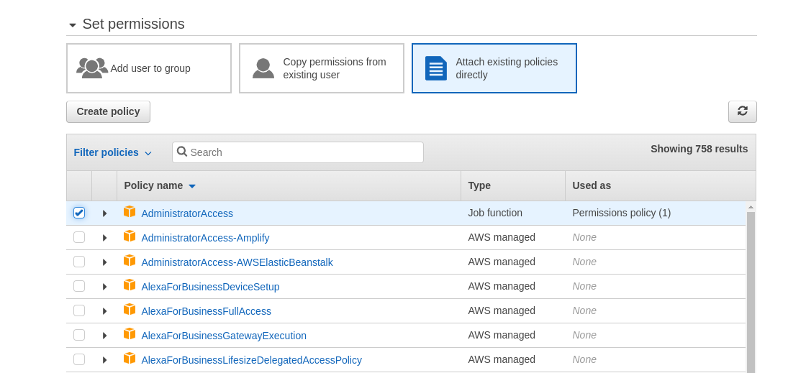
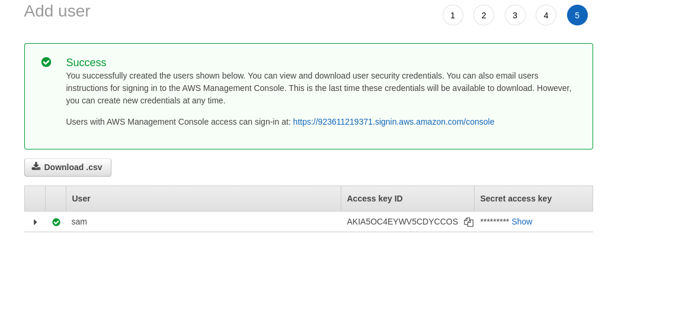
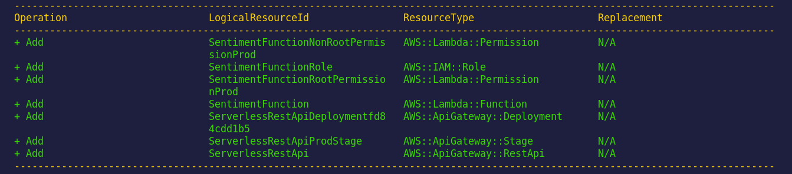
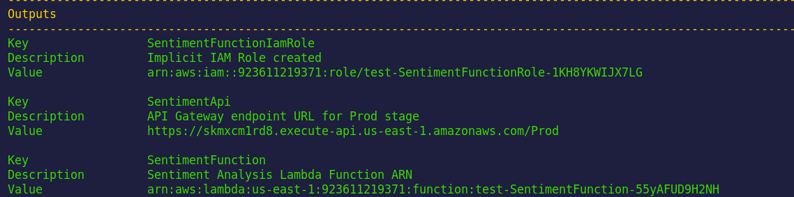
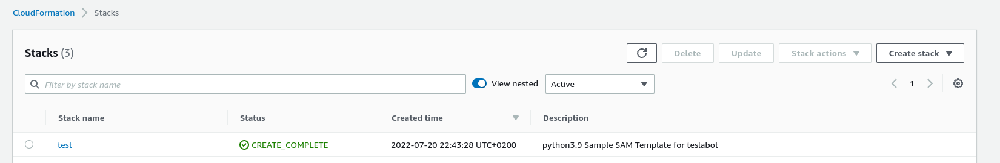
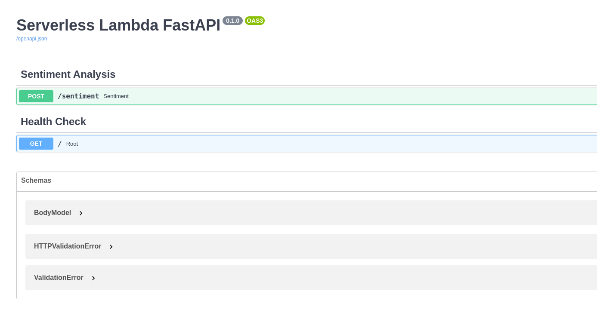
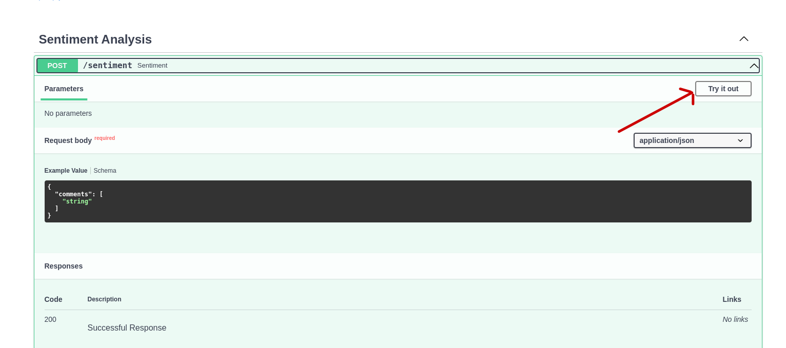
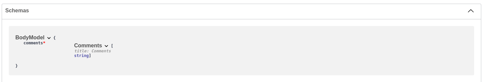

<p align = "center" draggable=”false” >
</p>


# <h1 align="center" id="heading">Model Serving</h1>

This week, a colleague passed their Tesla sentiment analysis model to you and would like your help to deploy it to a production environment as a serverless application via AWS Lambda.

## Deliverable

- Link to the repo that hosts Tesla sentiment analysis model

## ☑️ Objectives

At the end of this session, you will be able to:
- [ ] Build and deploy a model via SAM (Serverless Application Model) CLI
- [ ] Implement your ML App on AWS Lambda
- [ ] Deploy your ML App to a public endpoint


## Task 1. Create a repo for `teslabot`

1. Create a repo named `teslabot` including `.gitignore` and a license, and add all the content inside `teslabot` folder to it. For the rest of assignment, you will be working on the repo. 
   
   The structure of your local repo should look like (run `tree -a .`)
   ```
   .
   ├── .git
   ├── .gitignore
   ├── Dockerfile
   ├── LICENSE
   ├── README.md
   ├── app.py
   ├── events
   │   └── event.json
   ├── get_model.py
   ├── requirements.txt
   └── template.yaml
   ```

2. Inspect each of the files and make sure you understand what they are doing.
   - `get_model.py` contains the code to perform the sentiment analysis.
   - `app.py` contains the code to handle the request and return the result.
   - `requirements.txt` contains the dependencies of your ML App.
   - `Dockerfile` contains all the commands to assemble a docker image.
   - `events/event.json` contains the event that triggers the sentiment analysis.
   - `template.yaml` defines the application's AWS resources and is required when using SAM CLI.
      The application uses several AWS resources, including Lambda functions and an API Gateway API. These resources are defined in the `template.yaml`. You can update the template to add AWS resources through the same deployment process that updates your application code.


## Task 2. Build and Test Locally via SAM CLI

1. To build and deploy your application for the first time, run the following in your shell. **Keep in mind `teslabot%` is just the terminal location and is not to be included in your command**:

   ```bash
   teslabot% sam build
   ```

   It can take a few minutes to complete. The SAM CLI builds a docker image from a Dockerfile and then installs dependencies defined in `requirements.txt` inside the docker image. The processed template file is saved in the `.aws-sam/build` folder. 

   <details>
   <summary>View the long build output from SAM CLI </summary>

   ```
   teslabot % sam build
   Your template contains a resource with logical ID "ServerlessRestApi", which is a reserved logical ID in AWS SAM. It could result in unexpected behaviors and is not recommended.
   Building codeuri: <path_to_your_local_repo> runtime: None metadata: {'Dockerfile': 'Dockerfile', 'DockerContext': '<path_to_your_local_repo>', 'DockerTag': 'python3.9-v1'} architecture: x86_64 functions: SentimentFunction
   Building image for SentimentFunction function
   Setting DockerBuildArgs: {} for SentimentFunction function
   Step 1/8 : FROM amazon/aws-lambda-python:3.8
   3.8: Pulling from amazon/aws-lambda-python 
   3669dba1fd9d: Pull complete 
   8115ac3e4ae8: Pull complete 
   e225ff4503c3: Pull complete 
   cdd8ca1359da: Pull complete 
   b59d339d74eb: Pull complete 
   864336a47a0d: Pull complete 
   Status: Downloaded newer image for amazon/aws-lambda-python:3.8 ---> 29f599580e96
   Step 2/8 : RUN yum install gcc -y
   ---> [Warning] The requested image's platform (linux/amd64) does not match the detected host platform (linux/arm64/v8) and no specific platform was requested
   ---> Running in 64153d72f34c
   Loaded plugins: ovl
   Resolving Dependencies
   --> Running transaction check
   ---> Package gcc.x86_64 0:7.3.1-15.amzn2 will be installed
   --> Processing Dependency: libgomp = 7.3.1-15.amzn2 for package: gcc-7.3.1-15.amzn2.x86_64
   --> Processing Dependency: cpp = 7.3.1-15.amzn2 for package: gcc-7.3.1-15.amzn2.x86_64
   --> Processing Dependency: libsanitizer >= 7.3.1-15.amzn2 for package: gcc-7.3.1-15.amzn2.x86_64
   --> Processing Dependency: libquadmath >= 7.3.1-15.amzn2 for package: gcc-7.3.1-15.amzn2.x86_64
   --> Processing Dependency: libmpx >= 7.3.1-15.amzn2 for package: gcc-7.3.1-15.amzn2.x86_64
   --> Processing Dependency: libitm >= 7.3.1-15.amzn2 for package: gcc-7.3.1-15.amzn2.x86_64
   --> Processing Dependency: libcilkrts >= 7.3.1-15.amzn2 for package: gcc-7.3.1-15.amzn2.x86_64
   --> Processing Dependency: libatomic >= 7.3.1-15.amzn2 for package: gcc-7.3.1-15.amzn2.x86_64
   --> Processing Dependency: glibc-devel >= 2.2.90-12 for package: gcc-7.3.1-15.amzn2.x86_64
   --> Processing Dependency: binutils >= 2.24 for package: gcc-7.3.1-15.amzn2.x86_64
   --> Processing Dependency: libmpfr.so.4()(64bit) for package: gcc-7.3.1-15.amzn2.x86_64
   --> Processing Dependency: libmpc.so.3()(64bit) for package: gcc-7.3.1-15.amzn2.x86_64
   --> Processing Dependency: libgomp.so.1()(64bit) for package: gcc-7.3.1-15.amzn2.x86_64
   --> Running transaction check
   ---> Package binutils.x86_64 0:2.29.1-31.amzn2 will be installed
   ---> Package cpp.x86_64 0:7.3.1-15.amzn2 will be installed
   ---> Package glibc-devel.x86_64 0:2.26-59.amzn2 will be installed
   --> Processing Dependency: glibc-headers = 2.26-59.amzn2 for package: glibc-devel-2.26-59.amzn2.x86_64
   --> Processing Dependency: glibc-headers for package: glibc-devel-2.26-59.amzn2.x86_64
   ---> Package libatomic.x86_64 0:7.3.1-15.amzn2 will be installed
   ---> Package libcilkrts.x86_64 0:7.3.1-15.amzn2 will be installed
   ---> Package libgomp.x86_64 0:7.3.1-15.amzn2 will be installed
   ---> Package libitm.x86_64 0:7.3.1-15.amzn2 will be installed
   ---> Package libmpc.x86_64 0:1.0.1-3.amzn2.0.2 will be installed
   ---> Package libmpx.x86_64 0:7.3.1-15.amzn2 will be installed
   ---> Package libquadmath.x86_64 0:7.3.1-15.amzn2 will be installed
   ---> Package libsanitizer.x86_64 0:7.3.1-15.amzn2 will be installed
   ---> Package mpfr.x86_64 0:3.1.1-4.amzn2.0.2 will be installed
   --> Running transaction check
   ---> Package glibc-headers.x86_64 0:2.26-59.amzn2 will be installed
   --> Processing Dependency: kernel-headers >= 2.2.1 for package: glibc-headers-2.26-59.amzn2.x86_64
   --> Processing Dependency: kernel-headers for package: glibc-headers-2.26-59.amzn2.x86_64
   --> Running transaction check
   ---> Package kernel-headers.x86_64 0:4.14.287-215.504.amzn2 will be installed
   --> Finished Dependency Resolution

   Dependencies Resolved

   ================================================================================
   Package            Arch       Version                     Repository      Size
   ================================================================================
   Installing:
   gcc                x86_64     7.3.1-15.amzn2              amzn2-core      22 M
   Installing for dependencies:
   binutils           x86_64     2.29.1-31.amzn2             amzn2-core     5.8 M
   cpp                x86_64     7.3.1-15.amzn2              amzn2-core     9.2 M
   glibc-devel        x86_64     2.26-59.amzn2               amzn2-core     994 k
   glibc-headers      x86_64     2.26-59.amzn2               amzn2-core     515 k
   kernel-headers     x86_64     4.14.287-215.504.amzn2      amzn2-core     1.2 M
   libatomic          x86_64     7.3.1-15.amzn2              amzn2-core      46 k
   libcilkrts         x86_64     7.3.1-15.amzn2              amzn2-core      85 k
   libgomp            x86_64     7.3.1-15.amzn2              amzn2-core     204 k
   libitm             x86_64     7.3.1-15.amzn2              amzn2-core      85 k
   libmpc             x86_64     1.0.1-3.amzn2.0.2           amzn2-core      52 k
   libmpx             x86_64     7.3.1-15.amzn2              amzn2-core      51 k
   libquadmath        x86_64     7.3.1-15.amzn2              amzn2-core     189 k
   libsanitizer       x86_64     7.3.1-15.amzn2              amzn2-core     642 k
   mpfr               x86_64     3.1.1-4.amzn2.0.2           amzn2-core     208 k

   Transaction Summary
   ================================================================================
   Install  1 Package (+14 Dependent packages)

   Total download size: 41 M
   Installed size: 118 M
   Downloading packages:
   --------------------------------------------------------------------------------
   Total                                              758 kB/s |  41 MB  00:55     
   Running transaction check
   Running transaction test
   Transaction test succeeded
   Running transaction
   Installing : mpfr-3.1.1-4.amzn2.0.2.x86_64                               1/15 
   Installing : libmpc-1.0.1-3.amzn2.0.2.x86_64                             2/15 
   Installing : cpp-7.3.1-15.amzn2.x86_64                                   3/15 
   Installing : libgomp-7.3.1-15.amzn2.x86_64                               4/15 
   Installing : libcilkrts-7.3.1-15.amzn2.x86_64                            5/15 
   Installing : libsanitizer-7.3.1-15.amzn2.x86_64                          6/15 
   Installing : libatomic-7.3.1-15.amzn2.x86_64                             7/15 
   Installing : libquadmath-7.3.1-15.amzn2.x86_64                           8/15 
   Installing : kernel-headers-4.14.287-215.504.amzn2.x86_64                9/15 
   Installing : glibc-headers-2.26-59.amzn2.x86_64                         10/15 
   Installing : glibc-devel-2.26-59.amzn2.x86_64                           11/15 
   Installing : libitm-7.3.1-15.amzn2.x86_64                               12/15 
   Installing : libmpx-7.3.1-15.amzn2.x86_64                               13/15 
   Installing : binutils-2.29.1-31.amzn2.x86_64                            14/15 
   Installing : gcc-7.3.1-15.amzn2.x86_64                                  15/15 
   Verifying  : glibc-devel-2.26-59.amzn2.x86_64                            1/15 
   Verifying  : binutils-2.29.1-31.amzn2.x86_64                             2/15 
   Verifying  : libmpx-7.3.1-15.amzn2.x86_64                                3/15 
   Verifying  : libitm-7.3.1-15.amzn2.x86_64                                4/15 
   Verifying  : kernel-headers-4.14.287-215.504.amzn2.x86_64                5/15 
   Verifying  : libmpc-1.0.1-3.amzn2.0.2.x86_64                             6/15 
   Verifying  : glibc-headers-2.26-59.amzn2.x86_64                          7/15 
   Verifying  : libquadmath-7.3.1-15.amzn2.x86_64                           8/15 
   Verifying  : libatomic-7.3.1-15.amzn2.x86_64                             9/15 
   Verifying  : libsanitizer-7.3.1-15.amzn2.x86_64                         10/15 
   Verifying  : gcc-7.3.1-15.amzn2.x86_64                                  11/15 
   Verifying  : libcilkrts-7.3.1-15.amzn2.x86_64                           12/15 
   Verifying  : cpp-7.3.1-15.amzn2.x86_64                                  13/15 
   Verifying  : libgomp-7.3.1-15.amzn2.x86_64                              14/15 
   Verifying  : mpfr-3.1.1-4.amzn2.0.2.x86_64                              15/15 

   Installed:
   gcc.x86_64 0:7.3.1-15.amzn2                                                   

   Dependency Installed:
   binutils.x86_64 0:2.29.1-31.amzn2                                             
   cpp.x86_64 0:7.3.1-15.amzn2                                                   
   glibc-devel.x86_64 0:2.26-59.amzn2                                            
   glibc-headers.x86_64 0:2.26-59.amzn2                                          
   kernel-headers.x86_64 0:4.14.287-215.504.amzn2                                
   libatomic.x86_64 0:7.3.1-15.amzn2                                             
   libcilkrts.x86_64 0:7.3.1-15.amzn2                                            
   libgomp.x86_64 0:7.3.1-15.amzn2                                               
   libitm.x86_64 0:7.3.1-15.amzn2                                                
   libmpc.x86_64 0:1.0.1-3.amzn2.0.2                                             
   libmpx.x86_64 0:7.3.1-15.amzn2                                                
   libquadmath.x86_64 0:7.3.1-15.amzn2                                           
   libsanitizer.x86_64 0:7.3.1-15.amzn2                                          
   mpfr.x86_64 0:3.1.1-4.amzn2.0.2                                               

   Complete!
   Removing intermediate container 64153d72f34c
   ---> 71ff82b18c87
   Step 3/8 : COPY requirements.txt  .
   ---> 684d980036d9
   Step 4/8 : RUN  pip3 install -r requirements.txt --target "${LAMBDA_TASK_ROOT}"
   ---> [Warning] The requested image's platform (linux/amd64) does not match the detected host platform (linux/arm64/v8) and no specific platform was requested
   ---> Running in be550950b05f
   Collecting numpy==1.23.1
   Downloading numpy-1.23.1-cp38-cp38-manylinux_2_17_x86_64.manylinux2014_x86_64.whl (17.1 MB)
      ━━━━━━━━━━━━━━━━━━━━━━━━━━━━━━━━━━━━━━━━ 17.1/17.1 MB 2.3 MB/s eta 0:00:00
   Collecting transformers[torch]
   Downloading transformers-4.21.0-py3-none-any.whl (4.7 MB)
      ━━━━━━━━━━━━━━━━━━━━━━━━━━━━━━━━━━━━━━━━ 4.7/4.7 MB 934.5 kB/s eta 0:00:00
   Collecting mangum==0.15.0
   Downloading mangum-0.15.0-py3-none-any.whl (16 kB)
   Collecting fastapi==0.79.0
   Downloading fastapi-0.79.0-py3-none-any.whl (54 kB)
      ━━━━━━━━━━━━━━━━━━━━━━━━━━━━━━━━━━━━━━━━ 54.6/54.6 KB 3.9 MB/s eta 0:00:00
   Collecting pydantic==1.9.1
   Downloading pydantic-1.9.1-cp38-cp38-manylinux_2_17_x86_64.manylinux2014_x86_64.whl (12.7 MB)
      ━━━━━━━━━━━━━━━━━━━━━━━━━━━━━━━━━━━━━━━ 12.7/12.7 MB 594.7 kB/s eta 0:00:00
   Collecting uvicorn==0.18.2
   Downloading uvicorn-0.18.2-py3-none-any.whl (57 kB)
      ━━━━━━━━━━━━━━━━━━━━━━━━━━━━━━━━━━━━━━━━ 57.0/57.0 KB 1.9 MB/s eta 0:00:00
   Collecting typing-extensions
   Downloading typing_extensions-4.3.0-py3-none-any.whl (25 kB)
   Collecting starlette==0.19.1
   Downloading starlette-0.19.1-py3-none-any.whl (63 kB)
      ━━━━━━━━━━━━━━━━━━━━━━━━━━━━━━━━━━━━━━━━ 63.3/63.3 KB 4.0 MB/s eta 0:00:00
   Collecting click>=7.0
   Downloading click-8.1.3-py3-none-any.whl (96 kB)
      ━━━━━━━━━━━━━━━━━━━━━━━━━━━━━━━━━━━━━━━━ 96.6/96.6 KB 3.1 MB/s eta 0:00:00
   Collecting h11>=0.8
   Downloading h11-0.13.0-py3-none-any.whl (58 kB)
      ━━━━━━━━━━━━━━━━━━━━━━━━━━━━━━━━━━━━━━━━ 58.2/58.2 KB 4.2 MB/s eta 0:00:00
   Collecting anyio<5,>=3.4.0
   Downloading anyio-3.6.1-py3-none-any.whl (80 kB)
      ━━━━━━━━━━━━━━━━━━━━━━━━━━━━━━━━━━━━━━━━ 80.6/80.6 KB 2.9 MB/s eta 0:00:00
   Collecting huggingface-hub<1.0,>=0.1.0
   Downloading huggingface_hub-0.8.1-py3-none-any.whl (101 kB)
      ━━━━━━━━━━━━━━━━━━━━━━━━━━━━━━━━━━━━━━━ 101.5/101.5 KB 4.7 MB/s eta 0:00:00
   Collecting pyyaml>=5.1
   Downloading PyYAML-6.0-cp38-cp38-manylinux_2_5_x86_64.manylinux1_x86_64.manylinux_2_12_x86_64.manylinux2010_x86_64.whl (701 kB)
      ━━━━━━━━━━━━━━━━━━━━━━━━━━━━━━━━━━━━━━━ 701.2/701.2 KB 4.4 MB/s eta 0:00:00
   Collecting tokenizers!=0.11.3,<0.13,>=0.11.1
   Downloading tokenizers-0.12.1-cp38-cp38-manylinux_2_12_x86_64.manylinux2010_x86_64.whl (6.6 MB)
      ━━━━━━━━━━━━━━━━━━━━━━━━━━━━━━━━━━━━━━━━ 6.6/6.6 MB 4.4 MB/s eta 0:00:00
   Collecting filelock
   Downloading filelock-3.7.1-py3-none-any.whl (10 kB)
   Collecting packaging>=20.0
   Downloading packaging-21.3-py3-none-any.whl (40 kB)
      ━━━━━━━━━━━━━━━━━━━━━━━━━━━━━━━━━━━━━━━ 40.8/40.8 KB 444.9 kB/s eta 0:00:00
   Collecting regex!=2019.12.17
   Downloading regex-2022.7.25-cp38-cp38-manylinux_2_17_x86_64.manylinux2014_x86_64.whl (768 kB)
      ━━━━━━━━━━━━━━━━━━━━━━━━━━━━━━━━━━━━━ 768.2/768.2 KB 991.9 kB/s eta 0:00:00
   Collecting requests
   Downloading requests-2.28.1-py3-none-any.whl (62 kB)
      ━━━━━━━━━━━━━━━━━━━━━━━━━━━━━━━━━━━━━━━━ 62.8/62.8 KB 2.1 MB/s eta 0:00:00
   Collecting tqdm>=4.27
   Downloading tqdm-4.64.0-py2.py3-none-any.whl (78 kB)
      ━━━━━━━━━━━━━━━━━━━━━━━━━━━━━━━━━━━━━━━━ 78.4/78.4 KB 3.6 MB/s eta 0:00:00
   Collecting torch<1.12,>=1.0
   Downloading torch-1.11.0-cp38-cp38-manylinux1_x86_64.whl (750.6 MB)
      ━━━━━━━━━━━━━━━━━━━━━━━━━━━━━━━━━━━━━ 750.6/750.6 MB 324.9 kB/s eta 0:00:00
   Collecting pyparsing!=3.0.5,>=2.0.2
   Downloading pyparsing-3.0.9-py3-none-any.whl (98 kB)
      ━━━━━━━━━━━━━━━━━━━━━━━━━━━━━━━━━━━━━━━━ 98.3/98.3 KB 2.0 MB/s eta 0:00:00
   Collecting idna<4,>=2.5
   Downloading idna-3.3-py3-none-any.whl (61 kB)
      ━━━━━━━━━━━━━━━━━━━━━━━━━━━━━━━━━━━━━━━━ 61.2/61.2 KB 3.6 MB/s eta 0:00:00
   Collecting certifi>=2017.4.17
   Downloading certifi-2022.6.15-py3-none-any.whl (160 kB)
      ━━━━━━━━━━━━━━━━━━━━━━━━━━━━━━━━━━━━━━━ 160.2/160.2 KB 2.9 MB/s eta 0:00:00
   Collecting urllib3<1.27,>=1.21.1
   Downloading urllib3-1.26.11-py2.py3-none-any.whl (139 kB)
      ━━━━━━━━━━━━━━━━━━━━━━━━━━━━━━━━━━━━━━━ 139.9/139.9 KB 3.4 MB/s eta 0:00:00
   Collecting charset-normalizer<3,>=2
   Downloading charset_normalizer-2.1.0-py3-none-any.whl (39 kB)
   Collecting sniffio>=1.1
   Downloading sniffio-1.2.0-py3-none-any.whl (10 kB)
   Installing collected packages: tokenizers, urllib3, typing-extensions, tqdm, sniffio, regex, pyyaml, pyparsing, numpy, idna, h11, filelock, click, charset-normalizer, certifi, uvicorn, torch, requests, pydantic, packaging, mangum, anyio, starlette, huggingface-hub, transformers, fastapi
   Successfully installed anyio-3.6.1 certifi-2022.6.15 charset-normalizer-2.1.0 click-8.1.3 fastapi-0.79.0 filelock-3.7.1 h11-0.13.0 huggingface-hub-0.8.1 idna-3.3 mangum-0.15.0 numpy-1.23.1 packaging-21.3 pydantic-1.9.1 pyparsing-3.0.9 pyyaml-6.0 regex-2022.7.25 requests-2.28.1 sniffio-1.2.0 starlette-0.19.1 tokenizers-0.12.1 torch-1.11.0 tqdm-4.64.0 transformers-4.21.0 typing-extensions-4.3.0 urllib3-1.26.11 uvicorn-0.18.2
   WARNING: Running pip as the 'root' user can result in broken permissions and conflicting behaviour with the system package manager. It is recommended to use a virtual environment instead: https://pip.pypa.io/warnings/venv
   WARNING: You are using pip version 22.0.4; however, version 22.2.1 is available.
   You should consider upgrading via the '/var/lang/bin/python3.8 -m pip install --upgrade pip' command.
   Removing intermediate container be550950b05f
   ---> c322465d9bf1
   Step 5/8 : COPY ./get_model.py ${LAMBDA_TASK_ROOT}
   ---> d886ee010ead
   Step 6/8 : RUN python ${LAMBDA_TASK_ROOT}/get_model.py
   ---> [Warning] The requested image's platform (linux/amd64) does not match the detected host platform (linux/arm64/v8) and no specific platform was requested
   ---> Running in dca69bd3960b
   Downloading config.json: 100%|██████████| 629/629 [00:00<00:00, 91.9kB/s]
   Downloading pytorch_model.bin: 100%|██████████| 255M/255M [07:37<00:00, 586kB/s]  
   Some weights of the model checkpoint at distilbert-base-uncased-finetuned-sst-2-english were not used when initializing DistilBertModel: ['pre_classifier.weight', 'classifier.bias', 'classifier.weight', 'pre_classifier.bias']
   - This IS expected if you are initializing DistilBertModel from the checkpoint of a model trained on another task or with another architecture (e.g. initializing a BertForSequenceClassification model from a BertForPreTraining model).
   - This IS NOT expected if you are initializing DistilBertModel from the checkpoint of a model that you expect to be exactly identical (initializing a BertForSequenceClassification model from a BertForSequenceClassification model).
   Downloading tokenizer_config.json: 100%|██████████| 48.0/48.0 [00:00<00:00, 4.19kB/s]
   Downloading vocab.txt: 100%|██████████| 226k/226k [00:00<00:00, 1.01MB/s]
   Removing intermediate container dca69bd3960b
   ---> 3176eee79ed7
   Step 7/8 : COPY . ${LAMBDA_TASK_ROOT}
   ---> c44177ca6a92
   Step 8/8 : CMD [ "app.handler" ]
   ---> [Warning] The requested image's platform (linux/amd64) does not match the detected host platform (linux/arm64/v8) and no specific platform was requested
   ---> Running in dd0f8c90a0c0
   Removing intermediate container dd0f8c90a0c0
   ---> c803d2eb70d4
   Successfully built c803d2eb70d4
   Successfully tagged sentimentfunction:python3.9-v1


   Build Succeeded

   Built Artifacts  : .aws-sam/build
   Built Template   : .aws-sam/build/template.yaml

   Commands you can use next
   =========================
   [*] Validate SAM template: sam validate
   [*] Invoke Function: sam local invoke
   [*] Test Function in the Cloud: sam sync --stack-name {stack-name} --watch
   [*] Deploy: sam deploy --guided
   ```
   </details>

2. Test a single function locally. 

   Invoke it directly with a test event. An event is a JSON document that represents the input that the function receives from the event source. One sample `event.json` is provided under `events` directory.

   Run functions locally and invoke them with the `sam local invoke` command.

   ```bash
   teslabot% sam local invoke SentimentFunction --event events/event.json
   ```

   <details>
   <summary> Click here to see a sample output.</summary>

   ```
   Invoking Container created from sentimentfunction:python3.9-v1
   Image was not found.
   Removing rapid images for repo sentimentfunction
   Building image..................
   Skip pulling image and use local one: sentimentfunction:rapid-1.53.0-x86_64.

   START RequestId: 9614d618-6cae-47ad-931b-574bd8a45272 Version: $LATEST
   Some weights of DistilBertForSequenceClassification were not initialized from the model checkpoint at model and are newly initialized: ['pre_classifier.weight', 'classifier.weight', 'classifier.bias', 'pre_classifier.bias']
   You should probably TRAIN this model on a down-stream task to be able to use it for predictions and inference.
   END RequestId: 9614d618-6cae-47ad-931b-574bd8a45272
   REPORT RequestId: 9614d618-6cae-47ad-931b-574bd8a45272	Init Duration: 1.95 ms	Duration: 38117.95 ms	Billed Duration: 38118 ms	Memory Size: 1024 MB	Max Memory Used: 1024 MB	
   {"statusCode": 200, "headers": {"content-length": "60", "content-type": "application/json"}, "multiValueHeaders": {}, "body": "{\"result\":[{\"label\":\"NEGATIVE\",\"score\":0.5004699230194092}]}", "isBase64Encoded": false}
   ```

   This offers us an idea of the latency of our request, and how much memory it is using.

## Task 3. Deploy on AWS

1. Generating user credentials
   - The following instructions are important if you decide to use your own AWS account. **If you chose to use the AWS resources we have provided, you may skip to `Setting the Credentials` below.**
        
        Select `us-east-1` as the aws region for the remaining steps of the assignment.
   
      
   - Go to [Identity and Access Management (IAM)](https://us-east-1.console.aws.amazon.com/iamv2/home#/users)
   and click on `Users`. Add a new user by clicking on "add users"
   
   - Pick a name for the user (let's name it `sam`) and give it programmatic access using access key
      

   - Add permissions to the newly created user as the following
      

      **PLEASE NOTE THAT IT IS CONSIDERED A BAD PRACTICE TO GIVE A USER FULL ADMIN ACCESS. IDEALLY IT SHOULD BE ATTACHED TO POLICIES ACCORDING TO THE LEAST PRIViLEGE PRINCIPLE. WE ARE STRICLY USING THIS FOR THE CURRENT ASSIGNMENT TO REDUCE ISSUES RELATED TO RUNNING IT**
      
   - Proceed into the last step where you will be able to download the client ID and the client secret
   

   - **Setting the Credentials** - The next step is set the credentials as environment variables. On your open terminal, run the following commands:

   ```bash
      export AWS_ACCESS_KEY_ID=your_access_key_id
      export AWS_SECRET_ACCESS_KEY=your_secret_access_key
   ```

   while replacing your_access_key_id and your_secret_access_key with the values you find in the csv file you downloaded earlier. If you're using our AWS resources, you will use the keys we provided you.

2. Deployment using SAM CLI

   The command will package and deploy your application to AWS, with a series of prompts:

   ```bash
   sam deploy --guided
   ```

   - **Stack Name**: The name of the stack to deploy to CloudFormation. This should be unique to your account and region, and a good starting point would be something matching your project name.
   - **AWS Region**: The AWS region you want to deploy your app to.
   - **Confirm changes before deploy**: If set to yes, any change sets will be shown to you before execution for manual review. If set to no, the AWS SAM CLI will automatically deploy application changes. 
      
   - **Allow SAM CLI IAM role creation**: Many AWS SAM templates, including this example, create AWS IAM roles required for the AWS Lambda function(s) included to access AWS services. By default, these are scoped down to minimum required permissions. To deploy an AWS CloudFormation stack which creates or modifies IAM roles, the `CAPABILITY_IAM` value for `capabilities` must be provided. If permission isn't provided through this prompt, to deploy this example you must explicitly pass `--capabilities CAPABILITY_IAM` to the `sam deploy` command.
   - **Save arguments to samconfig.toml**: If set to yes, your choices will be saved to a configuration file inside the project, so that in the future you can just re-run `sam deploy` without parameters to deploy changes to your application.
   - **Potential Errors** - There are several areas this process can break at this point. This is where you may need to troubleshoot.
     - Error 1: Unable to upload artifact sentimentfunction:python3.9-v1 referenced by ImageUri parameter of SentimentFunction resource. **The security token included in the request is invalid.**
          - **Fix**: Please check that you entered the right access key and private access key for **setting the credentials** in task 3, step 1.
     - Error 2: Unable to upload artifact sentimentfunction:python3.9-v1 referenced by ImageUri parameter of SentimentFunction resource.
          - **Fix**: Modify your `samconfig.tml` and direct your `image repository` follows the same link in your ECR. Follow the following format.
          ```
          image_repositories = ["SentimentFunction=681261969843.dkr.ecr.us-east-1.amazonaws.com/samapp7427b055/sentimentfunction35d37012repo"]
          ```
     - Error 3: Error: Unable to upload artifact referenced by ImageUri parameter of  resource.500 Server Error: Internal Server Error ("Get "https://681261969843.dkr.ecr.us-east-1.amazonaws.com/v2/": Service Unavailable")
          - **Fix**: Please let us know as there may be permission issues with your account.


3. Find your API Gateway Endpoint URL in the output values displayed after deployment.

   


   We can find the deployment on [Cloud Formation stacks page](https://us-east-1.console.aws.amazon.com/cloudformation/home?region=us-east-1)

   


## Task 4. Testing API endpoint

1. Open your browser on the docs route to see the API documentation. Append `/docs` to the API Gateway Endpoint URL for access.

   

2. Test your API directly by starting with clicking on "Let's try out".

   

   and run a query. For example, change the provided request body to

   ```json
   {
      "comments": [
         "This is awesome !", "Tesla is not doing great in my opinion"
         ] 
   }
   ```

   The API only accepts request body that matches the format we have provided in the API definition.

   

3. Try a request body that violates the defined request schema. Can you explain the error message?

   ```json
   {"comments": "This is awesome !"}
   ```

4. Fetch, tail, and filter Lambda function logs.

   To simplify troubleshooting, command `sam logs` fetches logs generated by your deployed Lambda function from the command line. In addition to printing the logs on the terminal, this command has several nifty features to help you quickly find the bug.

   Note. This command works for all AWS Lambda functions; not just the ones you deploy using SAM.

   ```bash
   teslabot$ sam logs  --stack-name <stack-name> --tail --region us-east-1
   ```

   You can find more information and examples about filtering Lambda function logs in the [SAM CLI Documentation](https://docs.aws.amazon.com/serverless-application-model/latest/developerguide/serverless-sam-cli-logging.html).


5. Cleanup

   To delete the sample application that you created, use the AWS CLI. Assuming you used your project name for the stack name, you can run the following:

   ```bash
   aws cloudformation delete-stack --stack-name <stack-name> --region us-east-1
   ```

   On <https://us-east-1.console.aws.amazon.com/cloudformation/home?region=us-east-1>, you will notice that our stack doesn't exist anymore.

## [Optional] Task 5. Resources

1. Check the [AWS SAM developer guide](https://docs.aws.amazon.com/serverless-application-model/latest/developerguide/what-is-sam.html) for an introduction to SAM specification, the SAM CLI, and serverless application concepts.

   Next, you can use AWS Serverless Application Repository to deploy ready to use Apps that go beyond hello world samples and learn how others developed their applications: [AWS Serverless Application Repository main page](https://aws.amazon.com/serverless/serverlessrepo/)

2. Adding a Resource to your Application
   
   The application template uses AWS Serverless Application Model (AWS SAM) to define application resources. AWS SAM is an extension of AWS CloudFormation with a simpler syntax for configuring common serverless application resources such as functions, triggers, and APIs. For resources not included in [the SAM specification](https://github.com/awslabs/serverless-application-model/blob/master/versions/2016-10-31.md), you can use standard [AWS CloudFormation](https://docs.aws.amazon.com/AWSCloudFormation/latest/UserGuide/aws-template-resource-type-ref.html) resource types.
